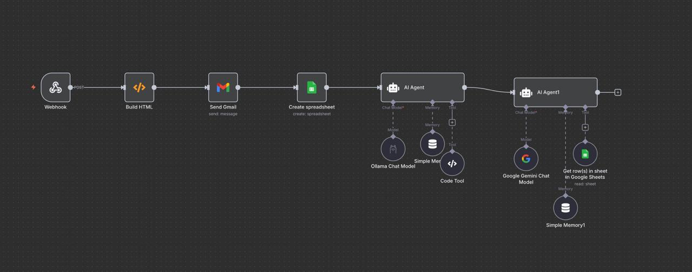
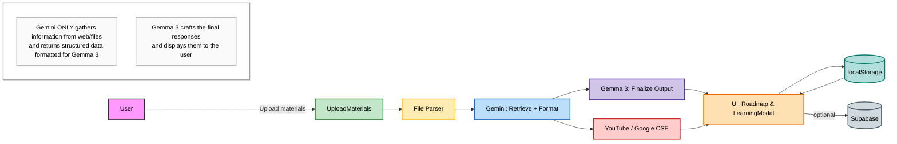

# Questly Architecture Documentation

This document describes Questly's end-to-end architecture, emphasizing the roles of **Gemini** (retrieval and formatting) and **Gemma 3** (final user-facing assistant), plus the UI flow, persistence, and external services.

---

## 🏗️ High-Level Components

### User Interface Layer
**Technology Stack:** React + Vite + shadcn/ui

#### Pages
- `Index` — Main dashboard and entry point
- `UploadMaterials` — Material upload and processing interface
- `Roadmap` — Interactive skill tree visualization
- `Quiz` — Assessment interface

#### Components
- `LearningModal` — Checkpoint learning experience
- `ChatPanel` — Interactive conversation interface
- `StudyCard` — Study session display cards
- `UploadCard` — File upload interface components

### Data & Persistence Layer

#### Local Storage
- **Implementation:** `localStorage` via `src/lib/localStore.ts`
- **Stores:** Studies, topics, quizzes, resume points

#### Cloud Storage (Optional)
- **Service:** Supabase
- **Configuration:** `src/lib/supabase.ts`
- **Use Case:** Production-grade persistent storage

### AI & Integration Layer

#### Gemini (`src/lib/gemini.ts`)
- Web and file information retrieval
- YouTube query refinement
- Checkpoint extraction from content
- Data formatting for Gemma 3 consumption

#### Gemma 3 (Final Assistant)
- Prepares final outputs based on Gemini-formatted inputs
- Displays polished responses to users
- Handles user-facing explanations

#### External Services
- **YouTube Data API** (or Google Custom Search Engine)
- **Purpose:** Fetches embeddable learning videos

---

## 🔄 N8N Automation Layer



### Workflow Pipeline
The automation layer handles background processing and integration tasks:

- **Webhook Trigger** — Initiates workflows from external events
- **HTML Builder** — Generates formatted output documents
- **Gmail Integration** — Sends notifications and updates
- **Google Sheets** — Persists processed data and logs

### AI Agent Orchestration
Dual-agent system for intelligent task routing:

#### Primary Agent
- **Model:** Ollama Chat Model
- **Memory:** Simple Memory context for conversation continuity

#### Secondary Agent
- **Model:** Google Gemini Chat Model
- **Purpose:** Specialized task handling

#### Supporting Tools
- **Code Tool** — Dynamic code execution capabilities
- **Sheet Integration** — Read/write operations to Google Sheets
- **Memory Persistence** — Context maintained across agent interactions

**Key Capability:** The N8N layer automates material processing, notifications, and spreadsheet management with dual AI agents handling intelligent routing and response generation.

---

## 📊 Data Flow Overview

The following diagram illustrates how data moves through the Questly system, from user upload to final display:



### Flow Explanation

1. **User Upload** → User submits learning materials through the UploadMaterials page
2. **File Parsing** → Content is extracted and preprocessed
3. **Gemini Processing** → Retrieves relevant information, extracts topics, and formats data
4. **YouTube Integration** → Fetches appropriate learning videos (parallel to Gemini)
5. **Gemma 3 Finalization** → Crafts polished, user-ready explanations and responses
6. **UI Display** → Renders roadmap and learning experiences
7. **Persistence** → Data saved to localStorage (and optionally Supabase)
8. **Resume Capability** → System can restore user progress from storage

**Key Distinction:** Gemini handles data gathering and structuring; Gemma 3 handles final user presentation.

---

## 🎯 Checkpoint Learning Sequence

This diagram shows the complete interaction flow when a user engages with a learning checkpoint:


### Sequence Breakdown

1. **Checkpoint Selection** — User clicks a topic in the roadmap skill tree
2. **Cache Check** — System attempts to load previously fetched video and quiz from localStorage
3. **Cache Miss Path** (if no cached data exists):
   - Request sent to Gemini for topic-specific video query and quiz generation
   - Gemini returns formatted video links and quiz questions
   - Results cached in localStorage for future access
4. **Video Display** — YouTube video embedded in the learning modal
5. **Content Presentation** — Gemma 3 provides final polished explanation to user
6. **Quiz Interaction** — User answers mini-quiz questions
7. **Progress Tracking** — System marks topic as completed and updates resume checkpoint

**Performance Optimization:** Caching prevents redundant API calls for previously accessed checkpoints.

---

## 📁 Key Files & Responsibilities

### `src/lib/gemini.ts`
Core AI integration module for content retrieval and formatting.

**Functions:**
- `generateCheckpointsWithGemini(content)` — Extract ordered learning topics from uploaded materials
- `refineQueryWithGemini(topic, baseQuery)` — Craft precise YouTube search queries
- `searchYouTube(query)` — Fetch embeddable videos via YouTube Data API
- `searchYouTubeViaGoogleCSE(query)` — Alternative video search via Google Custom Search
- `generateMiniQuizForTopic(topic)` — Create 1–N multiple-choice quiz questions

### `src/lib/localStore.ts`
Local persistence layer handling all browser storage operations.

**Schemas:**
- `LocalStudy` — Study session metadata
- `LocalTopic` — Individual topic progress and content

**Functions:**
- `setTopicQuiz(studyId, topicTitle, items)` — Save quiz questions for a topic
- `getTopicQuiz(studyId, topicTitle)` — Retrieve cached quiz questions
- **Tracking:** `last_checkpoint_title`, `last_opened_at`, topic `completed` status

### `src/components/LearningModal.tsx`
Interactive learning experience component.

**Responsibilities:**
- Load persisted quiz and video from cache
- Trigger Gemini generation for new topics
- Handle mini-quiz submission and validation
- Mark topics as completed upon successful quiz completion

### `src/pages/Roadmap.tsx`
Visual skill tree interface for learning progress.

**Features:**
- Display interactive checkpoint map
- Auto-resume from last accessed checkpoint
- Exit navigation returns to dashboard (`/`)

---

## ⚙️ Environment Configuration

### Required Variables

#### Gemini Configuration
```bash
VITE_GEMINI_API_KEY          # Required for AI retrieval and formatting
VITE_GEMINI_MODEL            # Optional: Override default Gemini model
VITE_GEMINI_BASE_URL         # Optional: Custom proxy (defaults to /gemini-api in dev)
```

#### Video Search Configuration
```bash
VITE_YOUTUBE_API_KEY         # YouTube Data API key
# OR alternative Google Custom Search
VITE_GOOGLE_CSE_API_KEY      # Google Custom Search API key
VITE_GOOGLE_CSE_CX           # Custom Search Engine ID
```

#### Ollama Configuration
```bash
VITE_OLLAMA_HOST             # Local LLM host for Gemma 3
VITE_OLLAMA_MODEL            # Gemma 3 model identifier
```

#### Optional Services
```bash
VITE_SUPABASE_URL            # Supabase project URL
VITE_SUPABASE_ANON_KEY       # Supabase anonymous key
```

---

## 🗺️ Application Routing

### Route Structure

| Route | Purpose | Key Features |
|-------|---------|--------------|
| `/` | Dashboard | Default landing page, study overview |
| `/upload` | UploadMaterials | File upload, content processing |
| `/roadmap` | Learning Path | Skill tree, auto-resume, progress tracking |
| `/quiz` | Assessment | Quiz interface and results |

### Navigation Behavior
- **Default Entry:** Root (`/`) serves as the main dashboard
- **Upload Flow:** UploadMaterials handles file processing and topic extraction
- **Learning Flow:** Roadmap resumes from last checkpoint if available
- **Exit Behavior:** Roadmap exit navigates back to dashboard (`/`)

---

## 🔍 System Design Principles

### Separation of Concerns
- **Gemini:** Data retrieval, structuring, and preprocessing
- **Gemma 3:** User-facing content generation and presentation
- **UI Layer:** Rendering and user interaction
- **Persistence:** State management and progress tracking

### Performance Optimization
- Aggressive caching of video URLs and quiz questions
- Lazy loading of checkpoint content
- Resume capability prevents redundant content generation

### Scalability
- Optional Supabase integration for cloud persistence
- N8N automation layer for background processing
- Modular architecture supports independent component scaling
