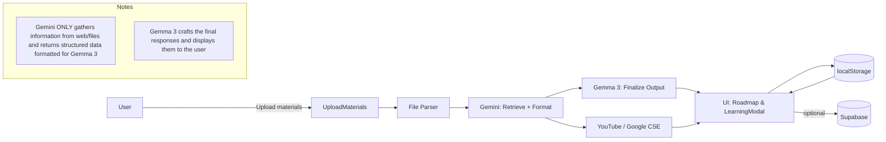
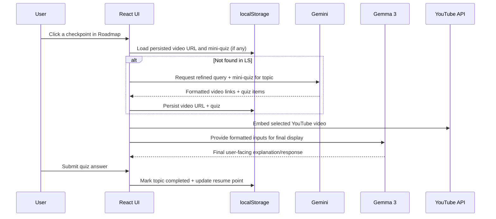

# Architecture

This document describes Questly’s end-to-end architecture, emphasizing the roles of Gemini (retrieval and formatting) and Gemma 3 (final user-facing assistant), plus the UI flow, persistence, and external services.

## High-Level Components

- UI (React + Vite + shadcn/ui)
  - Pages: `Index`, `UploadMaterials`, `Roadmap`, `Quiz`
  - Components: `LearningModal`, `ChatPanel`, `StudyCard`, `UploadCard`

- Data & Persistence
  - `localStorage` via `src/lib/localStore.ts` for studies, topics, quizzes, resume point
  - Supabase (`src/lib/supabase.ts`) for production storage (optional)

- AI & Integrations
  - Gemini (`src/lib/gemini.ts`): web/file information retrieval, YouTube query refinement, checkpoint extraction, mini-quiz generation, formatting for Gemma 3
  - Gemma 3 (final assistant): prepares and displays final outputs to the user based on Gemini-formatted inputs
  - YouTube Data API (or Google CSE): fetches embeddable learning videos

## Data Flow Overview

## Sequence: Checkpoint Learning

## Key Files

- `src/lib/gemini.ts`
  - `generateCheckpointsWithGemini(content)` — Extract ordered topics.
  - `refineQueryWithGemini(topic, baseQuery)` — Craft precise YouTube queries.
  - `searchYouTube(query)` / `searchYouTubeViaGoogleCSE(query)` — Fetch embeddable videos.
  - `generateMiniQuizForTopic(topic)` — Create 1–N mini multiple-choice items.

- `src/lib/localStore.ts`
  - `LocalStudy`, `LocalTopic` schemas
  - `setTopicQuiz(studyId, topicTitle, items)` / `getTopicQuiz(...)`
  - Tracks `last_checkpoint_title`, `last_opened_at`, topic `completed`

- `src/components/LearningModal.tsx`
  - Loads persisted quiz/video or triggers Gemini to generate and then persists
  - Handles mini-quiz submission and marks topic completion

- `src/pages/Roadmap.tsx`
  - Displays skill tree; auto-resumes last checkpoint; exits to `/`

## Environment & Config

- `VITE_GEMINI_API_KEY` — Required to enable Gemini retrieval/formatting
- `VITE_GEMINI_MODEL` — Optional Gemini model override
- `VITE_GEMINI_BASE_URL` — Optional base or proxy (defaults to `/gemini-api` in dev)
- `VITE_YOUTUBE_API_KEY` — YouTube Data API key (or `VITE_GOOGLE_CSE_API_KEY` + `VITE_GOOGLE_CSE_CX`)
- `VITE_SUPABASE_URL` / `VITE_SUPABASE_ANON_KEY` — Optional Supabase configuration
- `VITE_OLLAMA_HOST` / `VITE_OLLAMA_MODEL` — Optional local LLM host/model for Gemma 3

## Routing Notes

- Root (`/`) is the default dashboard
- `UploadMaterials` handles upload and processing
- `Roadmap` resumes from the last checkpoint if available
- Exit from Roadmap navigates back to `/`

## Future Enhancements

- Full Gemma 3 integration endpoint for final assistant responses
- Supabase syncing for cross-device persistence
- “Reset question” and checkpoint undo